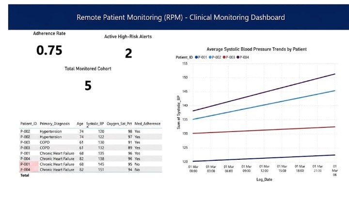

# Clinical Product Performance Dashboard

## Project Overview
This repository contains the backend database configuration, clinical risk intelligence logic, and frontend visualization blueprints for a **Remote Patient Monitoring (RPM)** data pipeline. The project bridges clinical safety parameters with product engagement metrics to identify high-risk patients and optimize care delivery compliance.

## Repository Contents
*   `01_database_setup.sql`: Generates the core database schema (`Patients` and `Vitals_Logs` tables) and populates them with simulated clinical tracking data.
*   `02_clinical_kpis.sql`: Implements advanced SQL analytical queries, featuring:
    *   **High-Risk Patient Alert System:** Targets specific biometric thresholds (e.g., Systolic BP $\ge$ 140 mmHg) mapped against medication non-adherence.
    *   **Cohort Adherence Optimization:** Aggregates compliant data logging behavior by medical diagnosis to guide clinical product adjustments.

## Technology Stack & Core Competencies
*   **SQL (Structured Query Language):** Schema architecture, conditional aggregations, relational logic.
*   **Data Architecture:** Relational dimension and fact modeling.
*   **BI & Data Visualization:** User experience engineering tailored for clinical operations and health tech product management.

---

## Dashboard Architecture Blueprint

### 🎨 Design & Color Strategy (Clinical UI Standards)
*   **Background:** High-contrast, clean off-white canvas optimized for fast-paced clinical monitoring environments.
*   **Primary Accent:** Deep Teal/Slate Blue (denoting stability, professional trust, and clarity).
*   **Alert Status:** Crimson Red (strictly reserved for critical biometric thresholds, e.g., Hypertensive Crisis triggers).
*   **Warning Status:** Amber/Orange (flagging sub-optimal compliance drift).

### 📊 The 3-Section Visual Layout

#### 1. Executive Summary Cards (Top Row)
*   **Total Monitored Cohort:** Distinct count of active patients currently enrolled in the RPM tracking track.
*   **Overall Program Adherence Rate:** Cumulative percentage of vital logs successfully submitted by patients.
*   **Active High-Risk Alerts:** Real-time volume count of patients currently breaching critical alert parameters.

#### 2. Clinical Risk Intelligence (Middle Section)
*   **High-Risk Patient Escalation Grid:** A structured list displaying Patient ID, Age, Primary Diagnosis, and Latest Systolic BP—leveraging conditional cell-highlighting (Crimson Red) for values $\ge$ 140 mmHg to immediately prioritize care coordinator outreach.
*   **Biometric Trend Longitudinal Line Chart:** A continuous dual-axis timeline tracking patient biometric variations over log cycles to detect early physiological decompensation.

#### 3. Product Engagement & Care Compliance (Bottom Section)
*   **Adherence Lag by Diagnosis (Horizontal Bar Chart):** Compares patient compliance percentages across specific medical conditions (e.g., Hypertension, Chronic Heart Failure, COPD). This highlights which tracking interfaces have the lowest user engagement, guiding product managers on where to adjust app UI or automated push notification workflows.
